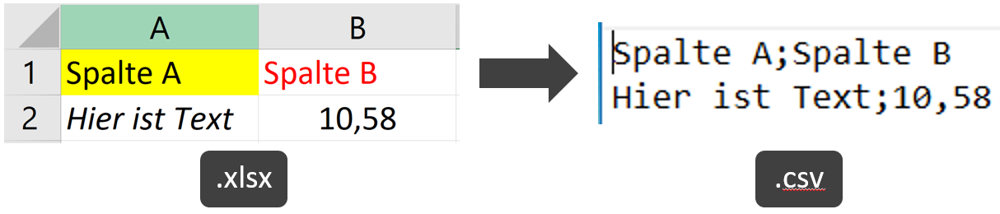

Hier werden kurz einige Möglichkeiten diskutiert

1. Daten in `R` zu importieren
2. Abbildungen und Ergebnisse aus `R` zu exportieren

# Working Directory
Bevor man sich mit dem Im- und Exportieren beschäftigt, sollte klar sein, was eine *working directory (wd)* in `R` ist und wie man damit umgeht. Kurz gesagt ist es einfach der Ordner/der Pfad auf dem Computer, in welchem `R` arbeitet und wo es deshalb Dateien sucht und speichert. Es kann frei entschieden werden welcher Ordner das sein soll, aber irgendeiner muss es sein. Wenn man ihn nicht selbst aussucht, wählt `R` einen default-Ordner aus. Um herauszufinden welcher Ordner aktuell als working directory festgelegt ist, kann die Funktion `getwd()` genutzt werden.

Es ist praktisch für jede Analyse/Arbeit einen bestimmten Ordner anzulegen und diesen mit `setwd()` als working directory festzulegen. Als Beispiel sagen wir unser Ordner heißt "Ordner2" und liegt im "Ordner1", welcher wiederum auf dem Desktop liegt. Hier liegen alle Informationen, wie z.B. die Daten, die wir später importieren wollen. Der Pfad heißt also: `C:\Users\Paul\Desktop\Ordner1\Ordner2`. Würde dort die Datei `Daten.csv` liegen und man wollte sie mit `read.table()` importieren (siehe unten) würde das wie folge ablaufen:

```{r, eval=FALSE}
# Ohne working directory festzulegen
read.table("C:/Users/Paul/Desktop/Ordner1/Ordner2/Daten.csv")

# Vorher working directory festlegen
setwd("C:/Users/Paul/Desktop/Ordner1/Ordner2/")
read.table("Daten.csv")
```

Wenn es natürlich bei diesem einen Import bliebe, macht es keinen großen Unterschied. Da man in der Regel allerdings auch noch mindestens etwas exportiert, lohnt es sich schnell, da die working directory nur einmal festgelegt werden muss, sodass alle folgenden Pfade abgekürzt werden können.

# Importieren

## Vergleich Dateiformate
Oft werden Daten in Programmen wie Excel, also Tabellenkalkulationssoftware, erfasst. Dies hat den großen Vorteil, dass die Eingabe und auch z.B. Sortierung der Daten schnell, interaktiv, intuitiv und übersichtlich ist. Excel-Dateien sind vom Typ `.xlsx`. 
Beschäftigt man sich allerdings mehr mit der Datenverarbeitung, fällt auf, dass dort Daten vom Typ `.csv` oder `.txt` bevorzugt werden. Dies sind in der Regel einfache Text-Dateien, deren Werte durch [bestimmte Zeichen](https://www.wikiwand.com/en/Delimiter-separated_values) getrennt sind. Die Abkürzung `csv` steht sogar für *comma-separated values*, sodass also alle Einträge durch Kommas getrennt werden. Es können aber auch andere Zeichen als Trennzeichen zum Einsatz kommen wie z.B. Semikolon, Doppelpunkt, Tabulatorzeichen, Leerzeichen. Im Endeffekt geht es aber immer darum einen Datensatz in einem möglichst simplen und deshalb zugleich speicherplatzsparendem und fehlerunanfälligem Format abzuspeichern.



Am Beispielbild wird allerdings auch deutlich, dass einige Informationen wie z.B. farbliche Formatierungen verloren gehen, wenn in solche ein *delimited text file* Format umgewandelt wird. Nichtsdestotrotz gilt:

**Dateien im delimited text file Format werden zum Im- und Export mit `R` bevorzugt, da der Prozess fehlerunanfällig und schnell funktioniert.**

## Delimited Text File Formate

### Basisfuntkion
Die **Basisfunktion** in `R` zum Import von Daten im delimited text file Format ist `read.table`. Man kann sehr viel angeben, wie z.B. ob die vorhanden Daten mit oder ohne Spaltennamen vorliegen oder was für ein Trennzeichen vorhanden ist. 
Im europäischen Raum darf nicht in Vergessenheit geraten werden, dass nicht überall auf der Welt Kommas als Dezimaltrennstellen benutzt werden: `10,58` in Deutschland entspricht `10.58` in den USA. Dies führt oft zu Probleme beim Import und sollte deshalb auch explizit beim Import/Export angegeben werden.
Schließlich gibt es Abwandlungen wie z.B. `read.csv`, `read.delim` oder `read.csv2`, die genau wie `read.table` funktionieren und lediglich *convenience functions* darstellen:

```{r, eval=FALSE}
read.table("Beispiel.csv", sep=";") # Semikolon als Trennzeichen
read.csv("Beispiel.csv") # Praktisch das gleiche wie der Befehl zuvor

read.table("Beispiel.csv", sep=";", dec=",") # Zusätzlich Komma als Dezimaltrennzeichen
read.csv2("Beispiel.csv") # Praktisch das gleiche wie der Befehl zuvor
```

Details finden sich z.B. [hier](https://cran.r-project.org/doc/manuals/R-data.html#Variations-on-read_002etable).

### Import mit data.table
Das `data.table` [package](https://cran.r-project.org/web/packages/data.table/index.html) bringt viele zusätzliche Funktionen mit sich. In diesem Kontext soll vor allem angemerkt werden, dass die Funktion `fread()` (fast read) im Prinzip eine schnellere und bequemere Version von `read.table` ist, was den Importprozess bei größeren Datensätzen schnell [auf einen Bruchteil reduzieren kann](https://csgillespie.github.io/efficientR/5-3-importing-data.html#fast-data-reading). Es muss allerdings klar sein, dass `fread()` die importierten Daten im `data.table` Format abspeichert und nicht wie `read.table()` imd `data.frame` Format. Das kann dem Nutzer oft egal sein, [es gibt aber Unterschiede im Handling](https://stackoverflow.com/questions/13618488/what-you-can-do-with-a-data-frame-that-you-cant-with-a-data-table).

```{r, eval=FALSE}
library(data.table)
fread("Beispiel.csv") # Gegenstück zum read.table() Beispiel oben
# fread versteht die Argumente sep=";" und dec="," erkennt die Trennzeichen in der Regel aber automatisch
```

## Excel (.xlsx) Dateien
Da viele ihre Daten mit Excel aufnehmen bzw. am Ende in Excel vorliegen haben, mag es umständlich erscheinen eine Excel-Datei erst in eine `.csv` oder `.txt.` Datei umzuwandeln. Tatsächlich wurde dies aber vor allem in der Vergangenheit aus den oben genannten Gründen viel gemacht. Zwar gibt es schon länger Funktionen auch Excel-Dateien direkt zu importieren, doch diese führten schlichtweg frustrierend oft zu Fehlern. Auch heute wird oft noch vermittelt, dass das direkte Importieren einer Excel-Datei wenn dann mit Vorsicht zu genießen ist. Dennoch gibt es in `R` Möglichkeiten mit denen ich solide Erfahrungen gemacht habe. Momentan nutze ich dafür das `readxl` [package](https://cran.r-project.org/web/packages/readxl/index.html). Man kann sogar mit dem Argument `range=` nur einen Teil eines Tabellenblatts auswählen, also beispielsweise A4:C10 und mehr.  


```{r, eval=FALSE}
library(readxl)
read_excel("Beispiel.xlsx", sheet="Blatt1") # Importiert das Tabellenblatt "Blatt1" aus der "Beispiel.xlsx" Datei
```

# Exportieren
Wenn eine Abbildung/ein Plot in `R` erstellet wurde, kann dieser natürlich aus dem Vorschaufenster durch Klicken auf den "Export" Button abgespeichert werden. Hier soll aber gezeigt werden wie Plots auch ohne zusätzliches Klicken exportiert werden können.

## ggplot2 Graphen
Für ggplot2 Objekte gibt es eine extrem praktische [Funktion namens](https://ggplot2.tidyverse.org/reference/ggsave.html) `ggsave()`. Sie kann jeden Plot, der mit `ggplot()` erstellt wurde mit verschiedenen Optionen abspeichern. Wenn nicht explizit ein Objekt angegeben wird, das den `ggplot()` output enthält, wird einfach der zuletzt erstellte Plot gespeichert.
Besonders nützlich ist, dass auch in Vektorgrafik-Formaten wie z.B. `.eps` abgespeichert und die genaue Größe in z.B. Pixeln oder cm vorgegeben werden kann

```{r, eval=FALSE}
library(ggplot2)
meinplot <- ggplot(...) # Erstellen und speichern eines Plots
ggsave(plot=meinplot, filename="PlotDateiName.png", width=20, height=20, units="cm") # Speichere Plot in 20cm x 20cm als png-Datei mit dem Namen "PlotDateiName"
```

## Tabellen/Daten
### Basisfunktion & data.table
Analog zu den oben gezeigten Importfunktionen `read.table` und `fread`, gibt es auch `write.table` und `fwrite`. Wieder können die `dec=` und `sep=` Funktionen genutzt werden:

```{r, eval=FALSE}
write.table(x=myRobject, file="DateiName.csv")
library(data.table)
fwrite(x=myRobject, file="DateiName.csv")
```

### Excel (.xlsx) Dateien
Auch der Export direkt in Excel-Dateien ist möglich. Hierfür nutze ich momentan das `openxlsx` [package](https://cran.r-project.org/web/packages/openxlsx/index.html) und somit ein anderes (!) als für den Import aus Excel. Der einfache Export einer Tabelle in eine Datei funktioniert mit `write.xlsx()` analog zu den anderen Funktionen:

```{r, eval=FALSE}
library(openxlsx)
write.xlsx(x=myRobject, file="DateiName.xlsx", sheetName="TabellenblattName")
```

Noch interessanter ist das package m.E. aber wenn es darum geht mehrere Tabellen in mehrere Tabellenblätter einer Datei zu schreiben. Das geschieht mit `saveWorkbook()`, indem erst ein *workbook* Objekt erstellt wird, welches nach und nach mit Tabellenblättern befüllt wird:

```{r, eval=FALSE}
wb <- createWorkbook()
  addWorksheet(wb, "TabellenblattName1")
  writeData(wb, "TabellenblattName1", myRobject1)
  addWorksheet(wb, "TabellenblattName2")
  writeData(wb, "TabellenblattName2", myRobject2)
saveWorkbook(wb, file="DateiName.xlsx")
```

Es ist auch möglich bestimmte Formatierugen vorzunehmen. Beispielsweise können die einzelnen Spalten als unterschiedlich breit festgelegt werden:

```{r, eval=FALSE}
setColWidths(wb, sheet="TabellenblattName1", 
             cols = c("Spalte1", "Spalte2", "Spalte3"), 
             widths = c(25, 3, 3))
```

Oder auch farbliche Hervorhebungen usw. können schon beim Export in `R` vorgenommen werden:
```{r, eval=FALSE}
hs <- createStyle(fontColour="white", fontSize=14, textDecoration="bold",
                  fgFill="green", 
                  border=c("top", "bottom"), borderStyle="dotted", 
                  halign="center", valign="center",
                  textRotation=45)

write.xlsx(x=myRobject, file="DateiName.xlsx", sheetName="TabellenblattName", 
           borders="surrounding", headerStyle=hs)
```

Mehr Infos gibt es [hier](https://rdrr.io/cran/openxlsx/man/createStyle.html) und [hier](https://cran.r-project.org/web/packages/openxlsx/vignettes/Introduction.pdf).