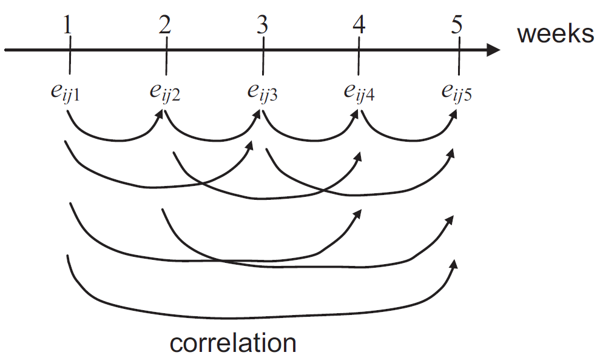

```{r, echo=FALSE, warning=FALSE, message=FALSE, error=FALSE}
library(data.table)
library(nlme)
load("D:/RKurse/Dokumentation/crashcouRse/datasets/sorghum repmes.rda")
```

```{r, eval=FALSE, warning=FALSE, message=FALSE, error=FALSE}
library(data.table) # bessere Datenmanipulation
library(nlme)   # gemischtes Modell package 1
library(asreml) # gemischtes Modell package 2 - benötigt R version 3.2.3. und Lizenz
```

# Datensatz

In diesem Experiment wurde in einer randomisierten vollständigen Blockanlage (RCBD) mit 5 Wiederholungen der Blattflächenindex von 5 Sorghumsorten verglichen. Allerdings wurde der Blattflächenindex mehrfach, nämlich in 5 aufeinanderfolgenden Wochen, gemessen, sodass Messwiederholungen vorliegen. 

> Dieses Beispiel basiert auf *Example 4* des `agriTutorial` packages und der dazugehörigen Veröffentlichung
> <br />
> Piepho, H. P., & Edmondson, R. N. (2018). A tutorial on the statistical analysis of factorial experiments with qualitative and quantitative treatment factor levels. Journal of Agronomy and Crop Science.

Messwiederholungen werfen eine Neuerung gegenüber den vorangegangenen Beispielen auf: zum ersten Mal ist die kleinste Randomisationseinheit (=Parzelle) nicht gleichzeitig die Beobachtungseinheit, da wir mehrere Beobachtungen pro Parzelle haben. Der wichtige Punkt hier ist, dass der Faktor Woche nicht randomisiert werden kann. Statt der üblichen Annahme von unabhängigen Messwerten, sind Messwerte derselben Parzelle von aufeinanderfolgenden Wochen wahrscheinlich miteinander korreliert. Um dies zu modellieren, soll im ersten Schritt vorerst das Modell für die Analyse einer einzelnen Woche aufgestellt werden.   

<div class = "row"> <div class = "col-md-6">
```{r}
print(repmes, nrows=10)
```
</div> <div class = "col-md-6">
```{r}
str(repmes, width=40, strict.width="cut")
```
</div> </div>

# Analyse einer einzelnen Woche

Wenn wir jede Woche separat analysieren, umgehen wir das Problem der korrelierten Messwerte und können das übliche Modell für eine einfaktorielle Varianzanalyse in einem RCBD aufstellen ( [siehe Beispiel](1wayANOVA_rcbd.html) ).

## Manuelle Analyse

Dann müssen wir lediglich einen Teildatensatz mit den Daten von nur einer Woche erstellen und auswerten.

```{r}
repmes.wk1 <- repmes[week=="1"] # Nur Daten der ersten Woche
mod.wk1 <- lm(y ~ gen + rep, data=repmes.wk1)
anova(mod.wk1)
```

So erhalten wir also die Ergebnisse der Varianzanalyse für die erste Woche und könnten wie gewohnt fortfahren indem wir adjustierte Mittelwerte für den signifikanten Faktor Sorte berechnen. 

## Analyse in einem Loop

Anstatt die 5 Teildatensätze der 5 Wochen separat und manuell zu erstellen, können wir eine Schleife (*Loop*) schreiben, die automatisch eine Woche nach der anderen analysiert. Zusätzlich können wir in R eine *Liste* erstellen, in der die Ergebnisse aller durch den Loop generierten Varianzanalysen gespeichert werden.

```{r}
anova.liste <- list() # erstelle ein leeres Listenobjekt

for (wochen.nr in c("1", "2", "3", "4", "5")){ # Loop Anfang
  repmes.wkX <- repmes[week==wochen.nr]
  mod.wkX <- lm(y ~ gen + rep, data=repmes.wkX)
  anova.liste[[wochen.nr]] <- anova(mod.wkX)
} # Loop Ende

anova.liste[["1"]] # Zeige ANOVA der 1. Woche
anova.liste[["5"]] # Zeige ANOVA der 5. Woche
```

# Analyse des gesamten Datensatzes

 Der Nachteil der separaten Analyse einzelner Wochen wird besonders deutlich, wenn wir uns vorstellen, dass wir Messwerte von sehr viel mehr Wochen hätten, deren ANOVAs nicht immer die gleichen Signifikanzen zeigen: Es kann schwierig sein eine wochenübergreifende Antwort zu geben. Außerdem wurde durch das separate Analysieren auch immer nur ein Bruchteil der Informationen genutzt. Demnach ist es erstrebenswert den Datensatz als ganzes mit einem geeigneten Modell auszuwerten. Dafür müssen wir Korrelationen zwischen den Fehlertermen verschiedener Wochen erlauben. Die Grafik, die aus dem oben erwähnten Artikel stammt, soll dies verdeutlichen.

## nlme & asreml-R

Wir werden hier die Modelle mit der `gls()` Funktion aus dem `nlme` package anpassen. Zu jedem Modell wird auch das Gegenstück in `asreml()` Syntax gezeigt, allerdings nicht ausgeführt. Das asreml-R version 3.0 package funktioniert nur mit älteren R-Version 3.2.3, die man [hier](https://cran.r-project.org/bin/windows/base/old/3.2.3/) herunterladen kann. Außerdem muss man eine Lizenz besitzen. An der Universität Hohenheim gibt es diese im ILIAS und man muss auch nach der Installation mit dem Hohenheimer VPN verbunden sein, damit das package funktioniert. Der Code dieses Beispiels ist auch [hier](https://github.com/SchmidtPaul/useful/tree/master/nlmeVSasreml) auf meinem GitHub verfügbar. 

## ID: unabhängige, homogene Varianzen

<div class = "row"> <div class = "col-md-6">

### nlme

```{r}
gls.id <- gls(y ~ week + week*gen + week*rep,
              data=repmes)
gls.id$sigma^2 # ID.var
```
</div> <div class = "col-md-6">

### asreml-R v3

```{r, eval=FALSE}
asr.id <- asreml(data  = repmes,
                 fixed = y ~ week + week:gen + week:rep)
summary(asr.id)$varcomp[,c(2,3,5)] # ID.var
```
</div> </div>

## DIAG: unabhängige, heterogene Varianzen

<div class = "row"> <div class = "col-md-6">

### nlme

```{r}
gls.dg <- gls(y ~ week + week*gen + week*rep,
              weights = varIdent(form = ~ 1|week),
              data=repmes)
c(gls.dg$sigma^2, coef(gls.dg$modelStruct$varStruct, unconstrained=T)) # DG.vars
```
</div> <div class = "col-md-6">

### asreml-R v3

```{r, eval=FALSE}
asr.dg <- asreml(data  = repmes,
                 fixed = y ~ week + week:gen + week:rep,
                 rcov  = ~ at(week):plot)
summary(asr.dg)$varcomp[,c(2,3,5)] # DG.vars
```
</div> </div>

## AR1: first order autoregressive

<div class = "row"> <div class = "col-md-6">

### nlme

```{r}
gls.ar <- gls(y ~ week + week*gen + week*rep,
              corr = corExp(form = ~ week|plot),
              data=repmes)
gls.ar$sigma^2 # AR1.var 
as.numeric(exp(-1/coef(gls.ar$modelStruct$corStruct, unconstrained=F))) # AR1.cor
```
</div> <div class = "col-md-6">

### asreml-R v3

```{r, eval=FALSE}
asr.ar <- asreml(data  = repmes,
                 fixed = y ~ week + week:gen + week:rep,
                 rcov  = ~ ar1(week):plot)
summary(asr.ar)$varcomp[,c(2,3,5)] # AR var + cor
```
</div> </div>

## CS: compound symmetry

<div class = "row"> <div class = "col-md-6">

### nlme

```{r}
gls.cs <- gls(y ~ week + week*gen + week*rep,
              corr  = corCompSymm(form = ~ week|plot),
              data=repmes)
gls.cs$sigma^2 # CS.var 
as.numeric(coef(gls.cs$modelStruct$corStruct, unconstrained=F)) # CS.cor
```
</div> <div class = "col-md-6">

### asreml-R v3

```{r, eval=FALSE}
asr.cs <- asreml(data  = repmes,
                 fixed = y ~ week + week:gen + week:rep,
                 rcov  = ~ cor(week):plot)
summary(asr.cs)$varcomp[,c(2,3,5)] # CS var + cor
```
</div> </div>

## UN: unstrukturiert

<div class = "row"> <div class = "col-md-6">

### nlme

```{r}
gls.un <- gls(y ~ week + week*gen + week*rep,
              corr    =  corSymm(form = ~ 1|plot),
              weights = varIdent(form = ~ 1|week),
              data=repmes)
c(gls.un$sigma^2, coef(gls.un$modelStruct$varStruct, unconstrained=T)) # UN.vars
gls.un$modelStruct$corStruct # UN.cors
```
</div> <div class = "col-md-6">

### asreml-R v3

```{r, eval=FALSE}
asr.un <- asreml(data  = repmes,
                 fixed = y ~ week + week:gen + week:rep,
                 rcov  = ~ us(week):plot)
summary(asr.un)$varcomp[, c(2,3,5)] # UN vars + cors
```
</div> </div>

