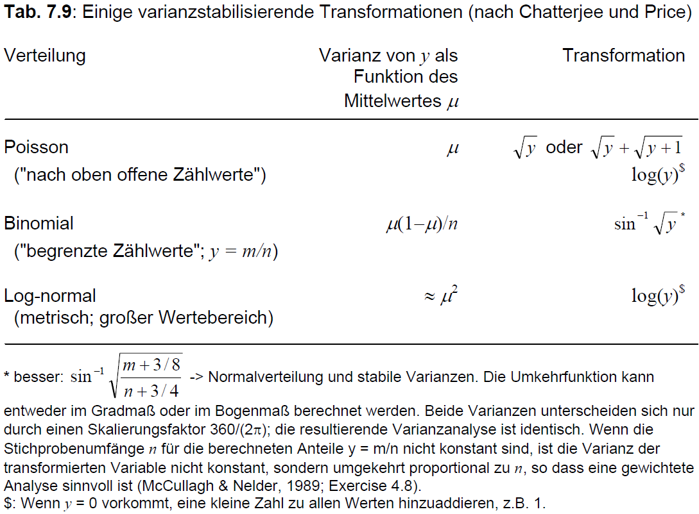
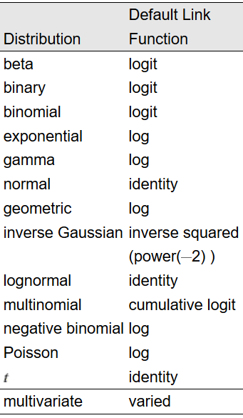
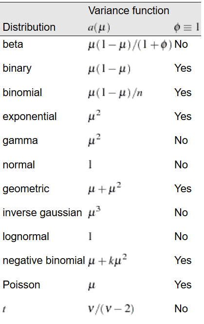

<style>
.column-left{
  float: left;
  width: 33%;
  text-align: center;
}
.column-center{
  display: inline-block;
  width: 33%;
  text-align: center;
}
.column-right{
  float: right;
  width: 33%;
  text-align: center;
}
</style>

```{r, echo=FALSE, warning=FALSE, message=FALSE, error=FALSE}
# Wird nicht gezeigt
```

# Datensatz

Hier wurde ein Experiment mit Mohrrüben durchgeführt ( [Jansen und Hoekstra, 1993](https://onlinelibrary.wiley.com/doi/abs/10.1111/j.1467-9574.1993.tb01414.x)). In einer randomisierten vollständigen Blockanlage wurden 16 Sorten bei zwei verschiedenen Insektizidbehandlungen untersucht und der Anteil der mit Rübenfliegen befallenen Pflanzen ermittelt. Der Datensatz ist im `agridat` package unter dem Namen `jansen.carrot` hinterlegt.

```{r}
library(agridat)
data(jansen.carrot)
library(data.table)
# kürzerer Name und data.table Format
carrot <- as.data.table(jansen.carrot) 
```

<div class = "row"> <div class = "col-md-6">
```{r}
head(carrot) # erste 6 Zeilen
```
</div> <div class = "col-md-6">
```{r, eval=FALSE}
str(carrot)
```
```{r, echo=FALSE, warning=FALSE, message=FALSE, error=FALSE}
str(carrot, width=40, strict.width="cut")
```
</div> </div>

Je Parzelle gibt `y` die Anzahl schadhafter Mohrrüben und `n` die Gesamtzahl von Mohrrüben an. Der prozentuale Befall kann also je Parzelle als `y/n` angegeben werden. Wir können eine neue Spalte mit eben diesem Anteil berechnen und genauer anschauen.

```{r}
# Erstelle Spalte "anteil"
carrot[, anteil := y/n] 
```

<div class = "row"> <div class = "col-md-6">
```{r}
boxplot(anteil ~ gen, data=carrot, las=2)
```
</div> <div class = "col-md-6">
```{r}
boxplot(anteil ~ trt, data=carrot, las=2)
```
</div> </div>

Beim Betrachten der Boxplots fällt auf, dass die Genotypen 1 und 2 einen höheren Anteil befallener Möhren aufweisen und somit anfälliger scheinen. 

# Problemfall Prozentzahlen in einem linearen Modell
Wäre in diesem Experiment ein anderes Merkmal wie z.B. der Ertrag gemessen worden, würde die Auswertung jetzt wie bei einer "normalen" zweifaktoriellen Varianzanalyse in einem vollständig randomisierten Blockdesign laufen (siehe [Kapitel 4](2F_rcbd.html)). Die Besonderheit an Prozentzahlen ist, dass sie oft mindestens eine der Annahmen einer Varianzanalyse verletzen (Die angegebene Reihenfolge der Voraussetzungen entspricht dabei ihrer Wichtigkeit):

1. Additivität der systematischen Effekte
2. Varianzhomogenität 
3. Normalverteilung der Fehler

Warum das so ist kann man sich z.B. vorstellen indem man sich vergegenwärtigt, dass Werte einer Sorte weniger schwanken, wenn sie gegen 0% oder 100% gehen. Die Werte einer mittelmäßig anfälligen Sorte hingegen schwanken wahrscheinlich mehr - sowohl über als auch unter 50%. Demnach ist die Varianz bei mittlerem Befall am größten, während sie bei kleinem oder hohen Befall sinkt. Anders ausgedrückt besteht ein direkter Zusammenhang zwischen dem Erwartungswert (einer Sorte) und der Varianz, was der Annahme der Varianzhomogenität widerspricht, weil laut dieser die Varianzen immer gleich sein müssten, egal wie hoch der Erwartungswert (der Sorte).

Um dies zu prüfen können wir lineares Modell wie in [Kapitel 4](2F_rcbd.html) aufstellen und uns die Residuenplots anschauen. Tatsächlich deutet der linke Plot ganz und gar nicht auf Varianzhomogenität hin:

```{r, fig.height = 3, fig.width = 7, fig.align = "center", warning=FALSE, message=FALSE, error=FALSE}
# Modell für zweifaktorielle Varianzanalyse in rand. vollst. Blockanlage
mod <- lm(anteil ~ block + gen + trt + gen:trt, data=carrot)
# Residuenplots mit autoplot Funktion aus ggfortify package
library(ggfortify)
autoplot(mod, which=1:2) 
```

Es muss klar sein, das die Varianzanalyse auch dann (in R) durchgeführt werden kann und somit Ergebnisse erzeugt werden, wenn die Annahmen verletzt sind. Diese Ergebnisse sind dann aber nicht zulässig/aussagekräftig. Es liegt daher in der Verantwortung des Auswertenden sicherzustellen, dass die Annahmen erfüllt sind. 

> **Sieht das jetzt gut genug aus?** 
<br />
> Häufig wird bemängelt, dass eine Beurteilung von Residuenplots subjektiv ist: Gerade mit wenig Erfahrung fällt die Entscheidung schwer ob der jeweilige Plot nun gut aussieht oder nicht. Um Orientierungspunkte zu geben, sind hier ein paar Residuenplots zum Verlgeich dargestellt: [UNDER CONSTRUCTION]. 
> <br />
> Es soll auch darauf hingewiesen sein, dass es Tests gibt, die einem eben diese Entscheidung abnehmen. Allerdings bergen solche Tests das Problem, dass sie das Gesamtbild nur "schwarz-weiß", also auf ein "ja" oder "nein" reduzieren, was zu einem Informationsverlust führt, da Residuenplots eben nicht nur perfekt oder vollkommen daneben aussehen können.


## Lösung 1: Datentransformation
Wenn man nicht die gemessenen Werte selbst auswertet, sondern sie vor der Auswertung transformiert, kann dies dazu führen, dass die Annahmen der Varianzanalyse (besser als vorher) erfüllt sind und man doch eine "normale" Varianzanalyse durchführen kann - nur eben mit den transformierten Werten.

*Transformieren* heißt hier durch eine Funktion umrechnen wie z.B. die Wurzel ziehen oder logarithmieren. Wenn also ein Fall wie der oben auftritt würde man also tatsächlich versuchen nicht den prozentualen Befall selbst (`anteil`) auszuwerten, sondern eine neue Spalte erstellen in der man beispielsweise `log(anteil)` berechnet und diese Werte dann auswertet. Auf den ersten Blick mag dies nicht logisch bzw. zielführend erscheinen (zumindest ging es mir so), da man so nicht mehr die natürliche Skala analysiert. Doch tatsächlich können dieselben biologisch relevanten Schlussfolgerungen, also z.B. *"Sorte 1 ist anfälliger als Sorte 3"* genauso gut auf Basis von logarithmierten Werten wie auf nicht logarithmierten Werten stattfinden - wobei "genauso gut" eben nicht stimmt, wenn die untransformierten Werte die Varianzanalyseannahmen nicht erfüllen, die transformierten Werte aber schon. In solche einem Fall sollte man also die transformierten Werte auswerten.

> **Ein weiteres Gedankenspiel zur Sinnigkeit von Transformationen**
<br /> 
> In einem Versuch wurden sowohl Blattlänge als auch Blattfläche bestimmt. Keins der beiden Merkmale kann als wichtiger oder richtiger gewertet werden als das andere. Da Blätter beim Wachsen ihre Form kaum ändern, ergibt sich allerdings kein linearer Zusammenhang zwischen den beiden Merkmalen. Das liegt daran, dass die Fläche etwa der quadrierten Länge entspricht und demnach die Blattfläche schneller größer wird als die Blattlänge. Ein Längenunterschied zwischen zwei Blättern von 1 cm führt bei kleinen Blättern zu einem kleineren Flächenunterschied als bei zwei großen Blättern.
Wenn also die Annahmen z.B. für Blattlänge stimmen, dürften sie das automatisch nicht für Blattfläche tun. 
> <br />
> Würde man allerdings die Blattflächenwerte transformieren indem man die Wurzel zieht, so ist es naheliegend, dass diese Werte die Annahmen einer Varianzanalyse erfüllen. Die natürliche Skala ist nicht immer die einfachste für eine statistische Analyse und in diesem Fall wäre es von Vorteil die Wurzel aus der Blattfläche anstatt der Blattfläche selbst zu analysieren.
 
Ziel einer Transformation der Daten ist also die Voraussetzungen, die für eine Varianzanalyse erforderlich sind, annähernd zu erfüllen. Es ist gängige Praxis für bestimmte Datentypen verschiedene Transformationen anzuwenden wie in der Übersichtstabelle beschrieben (Quelle: Biometrieksript [Prof. H.-P. Piepho](https://www.uni-hohenheim.de/organisation?tx_base_lsfcontentadmin[lsfPerson]=6257))

<center>

</center>
<br />

### Anwendung
Laut der Tabelle sollen wir also probieren unseren prozentualen Mohrrübenbefall mit der Arcus-Sinus-Wurzel-Transformation zu transformieren und prüfen ob die Annahmen dann erfüllt sind:

```{r}
# Erstelle Spalte "arcsin.anteil"
carrot[, arcsin.anteil := asin(sqrt(y/n))]
```

<div class = "row"> <div class = "col-md-6">
```{r}
boxplot(arcsin.anteil ~ gen, data=carrot, las=2)
```
</div> <div class = "col-md-6">
```{r}
boxplot(arcsin.anteil ~ trt, data=carrot, las=2)
```
</div> </div>

```{r, fig.height = 3, fig.width = 7, fig.align = "center"}
# Ersetze Zielvariable durch "arcsin.anteil"
mod.arcsin <- lm(arcsin.anteil ~ block + gen + trt + gen:trt, data=carrot) 
# Residuenplots
autoplot(mod.arcsin, which=1:2)
```

Tatsächlich sieht die Varianz homogener als noch im vorigen Residuenplot aus. Hinsichtlich der Annahme der Varianzhomogenität könnte man nun schon eher mit der Varianzanalyse fortfahren und ggf. Mittelwertvergleiche durchführen wie in [Kapitel 4](2F_rcbd.html). Es soll noch angemerkt sein, dass man die adjustierten Mittelwerte auch wieder zurücktransformieren kann, sodass sie wieder der natürlichen Skala entsprechen und somit (sowohl in einer Tabelle als auch in Graphen) intuitiver verständlich sind. Es sollte dann aber deutlich vermerkt werden, dass die Varianzanalyse und post-hoc Tests auf einer anderen, nämlich der transformierten Skala, stattgefunden haben.

Oft verbessert eine Transformation die Daten übrigens nicht nur hinsichtlich einer Annahme, sondern aller Annahmen. Das kann man sich so erklären, dass wenn man einen fiktiven Datensatz mit perfekter Einhaltung der Annahmen transformieren würde, er wahrscheinlich nicht nur hinsichtlich einer Annahme Abstriche machen muss. 

Für weiterführende, aber dennoch eingängig formulierte Informationen mit direktem Bezug zu R empfehle ich [Kapitel 3.3 von Doormann & Kühn](https://cran.r-project.org/doc/contrib/Dormann+Kuehn_AngewandteStatistik.pdf).

## Lösung 2: Generalisierte Modelle
Hin und wieder müssen Daten analysiert werden, bei denen selbst verschiedene Transformationen zu keiner zufriedenstellenden Verbesserung hinsichtlich der Annahmen einer Varianzanalyse führen. In solch einem Fall können **Generalisierte lineare Modelle (GLM)** angewndet werden. Bisher haben wir nur einfache, oder auch "generelle lineare Modelle (gLM)" genutzt. 

*Generalisiert* meint hier, dass zwei der Annahmen, nämlich die der *Varianzhomogenität* und der *Normalverteilung der Fehler* wegfallen. Es können nämlich andere Verteilungen wie z.B. die Poisson-Verteilung, die Binomial-Verteilung oder die Gammaverteilung angenommen werden. Und ja, die Varianzen müssen nicht länger homogen sein, aber es muss die Beziehung zwischen Erwartungswert und Varianz bekannt sein bzw. geraten werden, d.h. es muss eine Varianzfunktion angegeben werden. 

Außerdem bleibt natürlich die übrige Annahme der *Additivität der systematischen Effekte* bestehen. In die Klasse der GLMs fallen eine ganze Reihe gängiger Modelle, z.B. die Logit- und Probit-Regression für binomialverteilte Daten oder die loglinearen Modelle für poissonverteilte Daten. Die für uns “normalen” Modelle sind also ein Sonderfall der generalisierten Modelle, die normalverteilte Fehler mit homogener Varianz annehmen. Es soll gesagt sein, dass in der Praxis die oben beschrieben Schritte der Datentransformation manchmal auch übersprungen werden und einfach direkt ein GLM für bestimmte Datentypen angepasst wird - so z.B. für Prozentwerte (binomialverteilt) oder nach oben offene Zähldaten (poissonverteilt).

> **Was ist eigentlich mit Additivität gemeint?** 
<br />
> Nehmen wir an in einem Versuch wie dem Mohrrübenversuch hier, gibt es prozentuale Befallswerte von zwei Sorten (A und B) in mehreren Blöcken. In Block 1 hat Sorte A 50% Befall und Sorte B 70% Befall. In Block 2 herrschen deutlich günstigere Infektionsbedingungen, sodass Sorte A einen Befall von 90% aufweist. Das sind 40% mehr als in Block 1. Es ist allerdings unmöglich, dass auch Sorte B 40% mehr Befall in Block 2 aufweist, da der Befall nicht höher als 100% sein kann. Eine Additivität der Effekte ist nicht gegeben, sodass ein additives Modell nicht sinnvoll ist.

Übrigens muss klar sein, dass die Verwendung von GLM nicht automatisch bedeutet, dass keine Datentransformation mehr nötig ist. Stattdessen kann sich mit der eventuellen Datentransformation nun darauf konzentriert werden die letzte verbleibende Annahme der Additivität zu erzielen. Die Logit-Transformation ist in solch einem Fall eine gängige Methode, könnte also auch für das Beispiel im Anmerkungskasten hierüber angewendet werden.

> **Maximum Likelihood** 
<br />
> Einfache lineare Modelle (z.B. Regression oder Varianzanalyse) können mit der *Kleinstquadratlösung* (auch *Methode der minimalen Abweichungsquadrate*, *ordinary least squares (OLS)*) anayltisch mittels Matrixalgebra gelöst werden (siehe z.B. [Kapitel 6.6 von Doormann & Kühn](https://cran.r-project.org/doc/contrib/Dormann+Kuehn_AngewandteStatistik.pdf)).
> Es gibt auch den *maximum likelihood*-Ansatz und es kann gezeigt werden, dass bei für normalverteilte Daten bei einfachen lineare Modellen der *maximum likelihood*-Ansatz zum Kleinsquadratansatz führt. 
> Mittels des *maximum likelihood*-Ansatzes können auch Poisson-, binomial- oder anders verteilte Datensätze analysiert werden. Allerdings ist dieser eben nicht mehr analytisch lösbar. Stattdessen werden Parameter im Modell iterativ numerisch gelöst. Dieser Prozess ist rechenaufwendig und wurde deshalb erst mit der Entwicklung von leistungsfähigen Computern sowie der entsprechenden Statistiksoftware populär. 

### Die Link-Funktion
Wie schon kurz angedeutet, muss bei einem GLM stets eine Link-Funktion angegeben werden. Um zu verstehen was diese Funktion ver*link*t, sollten erst die wichtigsten Bezeichnungen und Formeln erklärt werden.

Bei Annahme der Normalverteilung lautet das lineare Modell $y=X\beta+e$, wobei $X\beta$ alle (festen) Effekte des Modells zusammenfasst. Da der Fehlerterm $e$ unbekannte, zufällige Streuung darstellt, entspricht der Erwartungswert $E(y)$ des Modells nur $X\beta$. Dieser Teil des Modells kann auch als *linearer Prädiktor*  $\eta$ bezeichnet werden. Im einfachen Fall entspricht der lineare Prädiktor dem Erwartungswert.

Bei einer Datentransformation wird eine Funktion $f()$, also z.B. `log()` oder `sqrt()` auf die Daten `y` angewendet. Der lineare Prädiktor entspricht dann dem Erwartungswert der transformierten Daten. 

Der große Unterschied bei einem GLM ist nun, dass nicht die Daten transformiert werden, sondern der lineare Prädiktor bzw. der Erwartungswert selbst. Dies geschieht mittels der *Link-Funktion* $g()$. 

<div class="column-left">
**lm ohne Datentransformation**
$E(y)=\eta=X\beta$  
<br /> <br /> <br /> 
</div>
<div class="column-center">
**lm mit Datentransformation**
$E[f(y)]=\eta=X\beta$ 
<br /> <br /> <br /> <br />
</div>
<div class="column-right">
**GLM ohne Datentransformation**
$g[E(y)]=\eta=X\beta$

beziehungsweise: <br />
$E(y)=g^{-1}(\eta)=g^{-1}(X\beta)$
</div>

Wird nun z.B. die logit-Transformation als Link-Funktion $g()=logit()$gewählt, so erhalten wir ein "Logit-Modell" oder "logtistisches Modell" als Sonderfall eines GLM. Das Modell ist weiterhin linear, allerdings gilt die lineare Beziehung mit dem Prädiktor nicht bezüglich des Messwertes. selbst, sondern für eine Funktion des Messwertes:

$$ logit(y) = log\left(\frac{y}{1-y}\right) = \eta = X\beta$$

Die Link-Funktion stellt also den Link zwischen Messwert und linearem Modell her. 

Wie schon erwähnt erlauben GLM neben der Normalverteilung auch andere Verteileungen. Für bestimmte Verteilungen gibt es gängige Link-Funktionen (siehe erste Tabelle).

Ebenfalls schon erwähnt erlauben GLM, dass die Varianz nicht mehr homogen sein muss. Stattdessen hängt die Varianz nun vom Erwartungswert ab - es besteht also ein direkter Zusammenhang zwischen Erwartungswert und Varianz. Diese Varianzfunktion hängt direkt von der gewählten Verteilung ab (siehe zweite Tabelle).

<div class = "row"> <div class = "col-md-6">
 
<br />
Quelle: [SAS Dokumentation](https://support.sas.com/documentation/cdl/en/statug/63033/HTML/default/statug_glimmix_a0000001411.htm#statug.glimmix.gmxlinktable)
</div> <div class = "col-md-6">
 <br />
Quelle: [SAS Dokumentation](https://support.sas.com/documentation/cdl/en/statug/63033/HTML/default/viewer.htm#statug_glimmix_a0000001415.htm)
</div> </div>

### Anwendung
Um also nun den prozentualen Befall unseres Mohrrübendatensatzes mit einem GLM auszuwerten müssen wir die Funktion `glm()` nutzen und zusätzlich Argumente zur Verteilung machen.

```{r}
mod.glm <- glm(y/n ~ block + gen + trt + gen:trt, 
               weights= n,
               family = binomial(link='logit'),
               data   = carrot)
```

Wie man sehen kann, wäre das vorige Berechnen der anteil-Spalte für das Aufstellen des Modells nicht nötig gewesen, da wir direkt `y/n` als Zielvariable schreiben können. Wichtig ist dabei aber, dass wir bei Angabe eines solchen Bruchs auch immer noch `weights=n` dazuschreiben müssen! *(Zur Info: Alternativ kann man statt `y/n` auch `cbind(y, n-y)` schreiben und das `weights=n` weglassen)* 

Als erwartete Verteilung schreiben wir hier vorerst `family=binomial`, sodass eine Binomialverteilung für die Fehler angenommen wird. Der Zusatz `(link="logit")` ist hier eigentlich überflüssig, weil dies die default Linkfunktion für binomialverteilte Daten ist - ich schreibe es aber der Klarheit gerne dazu. Da `glm()` eine Basis-Funktion von R ist - also kein extra package benötigt - können Residuenplots wieder einfach mit der `autoplot()` Funktion des `ggfortify` packages betrachtet werden:

```{r, fig.height = 3, fig.width = 7, fig.align = "center"}
autoplot(mod.glm, which=1:2)
```

Tatsächlich müssen wir die Residuenplots ja aber eben nicht betrachten um Normalverteilung und Varianzhomogenität zu beurteilen, da diese bei einem GLM ja nicht mehr angenommen werden müssen. 

### Devianzanalyse
Sobald wir mit unserem Modell zufrieden sind, würden wir gerne wie in [Kapitel 4](2F_rcbd.html) als nächstes mittels F-Test einer zweifaktoriellen Varianzanalyse prüfen wollen welche Behandlungseffekte signifikant sind. Bei GLM werden Varianzanalyse-Tabellen allerdings durch Devianzanalyse-Tabellen ersetzt. Praktischerweise macht dies für den Anwender keinen großen Unterschied in der Codierung und Interpretation der Ergebnisse.

```{r, warning=FALSE, message=FALSE, error=FALSE}
library(car)
Anova(mod.glm, test.statistic="Wald", type="III")
```

Laut der Devianzanalyse-Tabelle gibt es also eine signifikante Wechselwirkung zwischen den beiden Behandlungseffekten. Demnach müsste man im Anschluss die adjustierten Mittelwerte aller Genotype-Treatment-Kombinationen berechnen und miteinander (via post-hoc Tests) vergleichen wie z.B. in [Kapitel 4](2F_rcbd.html) oder [Kapitel 5](2F_splitplot.html).

### Über- und Unterdispersion
Wir wollen uns allerdings noch eines weiteren Aspektes der GLM zuwenden - dem Dispersionsparameter. Wie schon gesagt gibt es für jede Verteilung eine zugehörige Varianzfunktion und somit eine erwartete Varianz. Tatsächlich sind die beobachteten Varianzen aber manchmal größer oder kleiner als ihr Erwartungswert laut Varianzfunktion. Dieses Phänomen wird dann entsprechend als Über- und Unterdispersion bezeichnet.

Sollte solch ein Fall vorliegen, kann im Modell ein zusätzlicher *Dispersionsparameter* $\phi$ angepasst werden, der die Über- oder Unterdispersion sozusagen auffängt. Läge weder Über- noch Unterdispersion vor, so wäre $\phi=1$. Bei Unterdispersion ist $\phi<1$ und bei Überdispersion ist $\phi>1$.

Als Kontrolle lassen wir uns den Dispersionsparameter des eben angepassten Modells ausgeben:

```{r}
summary(mod.glm)$dispersion 
```

Es muss aber klar sein, dass $\phi$ hier nicht auf 1 geschätzt wurde, sondern auf 1 fixiert war, da wir explizit nur nach eine Binomialverteilung gefragt hatten. Um einen von 1 abweichenden Dispersionsparameter zu erlauben, müssen wir in `glm()` das `binomial` durch `quasibinomial` ersetzen:

```{r}
mod.glm2 <- glm(y/n ~ block + gen + trt + gen:trt, 
               weights= n,
               family = quasibinomial(link='logit'),
               data   = carrot)

summary(mod.glm2)$dispersion 
```

Da das Modell sich nun verändert hat, ergeben sich auch andere Testergebnisse in der Devianzanalyse-Tabelle:

```{r, warning=FALSE, message=FALSE, error=FALSE}
Anova(mod.glm2, test.statistic="Wald", type="III")
```

Die Wechselwirkung ist nun nicht mehr signifikant.