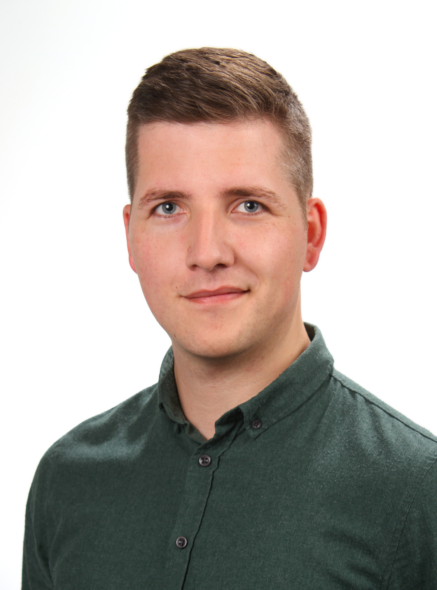

### Über mich

Ich habe 2019 meine **Promotion** im [Fachgebiet Biostatistik](https://www.uni-hohenheim.de/organisation/einrichtung/fg-biostatistik) an der Universität Hohenheim abgeschlossen und arbeite seitdem als **Data Scientist** bei [BioMath](https://www.biomath.de/). Desweiteren gebe ich **Workshops** in R für Einsteiger und Fortgeschrittene (siehe Tabelle unten).

schmidtpaul@hotmail.de

[LinkedIn](https://www.linkedin.com/in/schmidtpaul1989/)

[Xing](https://www.xing.com/profile/Paul_Schmidt203/cv)

[Publikationen (ResearchGate)](https://www.researchgate.net/profile/Paul_Schmidt17/research)

[GitHub mit Resultaten aus Promotion](https://github.com/PaulSchmidtGit/Heritability)

 

### Workshops

Name | Zeitraum | Dauer | Ort
-----------------|--------|----|------------
Statistical analysis with R | mtl. von 2016 bis 2018 | 9 h | Universität Hohenheim
Statistical analysis with SAS | mtl. von 2016 bis 2018 | 9 h | Universität Hohenheim
Implementation of yield stability assessment with ASReml-R | Mai 2018 | 6 h | Bangladesh Rice Research Institute, Gazipur
Gemischte Modelle in R | Nov 2018 | 20 h | Thünen-Institut, Braunschweig
Essential basics of statistics | Sep 2019 | 12 h | Universität Rostock
[Data Science in den Naturwissenschaften mit R (Teil 1)](https://biometrie-bmel.de/Kursinhalt?Kurs=2041) | Okt 2019 | 16 h | Thünen-Institut, Braunschweig
[Data Science in den Naturwissenschaften mit R (Teil 2)](https://biometrie-bmel.de/Kursinhalt?Kurs=2042) | Nov 2019 | 16 h | Thünen-Institut, Braunschweig
Basics of applied statistics | Dez 2019 | 12 h | Universität Rostock
[Real-time consultation on statistics and linear mixed models in R](https://www.uni-kassel.de/fb11agrar/fileadmin/datas/fb11/Tropenzentrum/Bilder/Realtime_consultation_on_statistics_Statistics_Workshop_for_PhDs_March_2020.pdf) | Mar 2020 | 9 h | Universität Kassel
[Data Science in den Naturwissenschaften mit R (Teil 1)](https://biometrie-bmel.de/Kursinhalt?Kurs=2066) | Jun 2020 | 16 h | Thünen-Institut, Braunschweig
[Data Science in den Naturwissenschaften mit R (Teil 2)](https://biometrie-bmel.de/Kursinhalt?Kurs=2069) | Oct 2020 | 16 h | Thünen-Institut, Braunschweig

