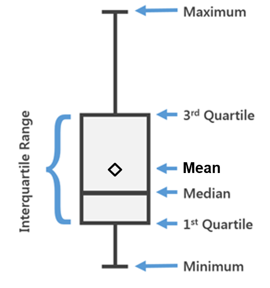

Gerade bei Analysen von Daten mit qualitativen/kategorialen Effekten bzw. Faktoren  geht es am Ende oft darum die Mittelwerte der Faktorstufen (z.B. von Sorte "A" & "B") zu betrachten und miteinander zu vergleichen. So z.B. sind [post hoc Tests](appendix_posthoc.html) oft der letzte Schritt einer statistischen Auswertung, da sie die Differenzen zwischen den Mittelwerten als signifikant oder eben nicht signifikant einstufen.

Somit gehören die Mittelwerte je Faktorstufe oft zu den wichtigsten Ergebnissen eines Experiments oder Forschungsprojekts. Da die Berechnung eines Mittelwerts aber zu den wenigen statistischen Maßzahlen gehört, die die meisten auch im Schlaf beherrschen, wird ihnen oft nicht viel Beachtung geschenkt. **Es gibt aber Fälle, in denen Mittelwert nicht gleich Mittelwert ist!**

# Der "normale Mittelwert"

Spricht man einfach nur vom "Mittelwert", meint man in der Regel den *arithmetischen Mittelwert*:

$$ A={\frac {1}{n}}\sum _{i=1}^{n}a_{i}={\frac {a_{1}+a_{2}+\cdots +a_{n}}{n}} $$

Hier findet keine Gewichtung oder ähnliches statt. Hat man auf seinen letzten `3` Spaziergängen `1`, `2` und `4` Hunde gesehen, dann ist das arithmetische Mittel an Hunden, die man auf diesen Spaziergängen gesehen hat `(1+2+4)/3=` ``r round((1+2+4)/3,2)``.

Bezeichnungen für diese Art Mittelwert sind z.B. *Mittelwert*, *artithmetischer Mittelwert*, *einfacher Mittelwert*, *mean*, *simple mean*, *arithmetic mean*, *observed mean*.

Diese Art Mittelwert lässt sich also sehr leicht berechnen und ist beispielsweise in einfachen Boxplots, also schon in der deskriptiven Statistik zu sehen (siehe Bild). In den allermeisten Fällen sind auch alle Mittelwerte, die jemand in einer Excel-Tabelle berechnet hat, mit der Funktion `=MITTELWERT()` berechnet worden und somit ebenfalls einfache, arithmetische Mittelwerte.

Prinzipiell ist an dieser Art Mittelwert auch überhaupt nichts auszusetzen und sie werden zurecht sehr häufig berechnet. Es muss aber klar sein, dass es auch noch andere Mittelwerte gibt und, dass diese unter bestimmten Bedingungen bevorzugt werden.

# Der adjustierte Mittelwert
Vorneweg: Es geht hier nicht um den [harmonischen Mittelwert](https://www.wikiwand.com/de/Harmonisches_Mittel) oder den [geometrischen Mittelwert](https://www.wikiwand.com/de/Geometrisches_Mittel). Mit **adjustierten Mittelwerten** meine ich hier was in R als **estimated (population) marginal mean (emmean)** und [SAS](https://www.wikiwand.com/en/SAS_(software)) oder [JMP](https://www.wikiwand.com/de/JMP_(Software)) als **Least Squares Means (LS-mean)** bezeichnet wird.

Adjustierte Mittelwerte können nur mithilfe von linearen Modellen berechnet werden. In R nutzt man dazu das package `emmeans` in welches man das Modell-Objekt, das vorher z.B. mit `lm()` erstellt wurde, einfügt. Unter bestimmten Bedingungen sollten adjustierte und nicht arithmetische Mittelwerte berechnet werden.

### Ein Beispiel

Als Beispiel ([Quelle](http://onbiostatistics.blogspot.com/2009/04/least-squares-means-marginal-means-vs.html)) wollen wir annehmen wir hätten sowohl in Hamburg, als auch in Rostock gezählt wie viel Hunde uns beim Spazierengehen begegnet sind. Das haben wir sowohl im Sommer, als auch im Winter mehrere Male getan. Allerdings sind wir nicht in allen der vier Kombinationen (Rostock-Sommer, Rostock-Winter usw.) gleich oft spazieren gegangen, sodass wir einen unbalancierten Datensatz vorliegen haben.

Wir könnten nun also nach der mittleren Anzahl Hunde im Winter und im Sommer fragen, also gemittelt über beide Städte. Würden wir lediglich die arithmetischen Mittelwerte berechnen, ergäbe sich für den Winter `(3+3+3+7+8)/5=` ``r round((3+3+3+7+8)/5,2)`` und für den Sommer `(5+6+3+5+7)/5=` ``r round((5+6+3+5+7)/5,2)``, wie auch in der oberen der beiden Tabellen angegeben. Man könnte also meinen, dass im Sommer mehr Hunde unterwegs sind.

Berechnet man nun aber adjustierte Mittelwerte, würden in diesem Beispiel quasi erst die arithmetischen Mittelwerte pro Kombination berechnet und diese dann wiederum arithmetisch gemittelt werden (*Achtung: Das soll nicht als allgemeingültige Vorgehensweise bei adjustierten Mittelwerten verstanden werden, funktioniert aber in diesem einfachen Beispiel um das Prinzip zu verdeutlichen*). So kommt es, dass laut adjustierten Mittelwerten, im Winter und Sommer genau gleich viele Hunde unterwegs sind- nämlich `5.25`. 

# Wann muss ich welchen Mittelwert berechnen?
Man kann mit der Berechnung von adjustierten Mittelwerten nie etwas falsch machen, da sie im einfachsten Fall einfach identisch zu den arithmetischen Mittelwerten sind. "Einfach" bedeutet dabei genauer gesagt einfaktorielle Modelle und/oder balancierte Daten. Wertet man allerdings einen unbalancierten Datensatz mit einem Modell mit mehreren Faktoren (z.B. Stadt und Jahreszeit) aus, unterscheiden sich die arithmetischen Mittelwerte von den adjustierten Mittelwerten und letztere sind zu bevorzugen! Hier die Aussage nochmal direkt aus der [SAS Dokumentation](https://support.sas.com/documentation/cdl/en/statug/63033/HTML/default/viewer.htm#statug_glm_a0000000861.htm): *"Computing and comparing arithmetic means—either simple or weighted within-group averages of the input data—is a familiar and well-studied statistical process. This is the right approach to summarizing and comparing groups for one-way and balanced designs. However, in unbalanced designs with more than one effect, the arithmetic mean for a group might not accurately reflect the "typical" response for that group, since it does not take other effects into account."*

Im Beispiel hier ist das Prinzip der Berechnung der adjustierten Mittelwerte noch leicht nachzuvollziehen. Das ist aber nicht immer so, da solche Mittelwerte auch für Modelle mit mehr als zwei Faktoren und ggf. zusätzlichen metrischen Kovariablen berechnet werden können. Normalerweise sollten arithmetische und adjustierte Mittelwerte auch wenn sie nicht identisch sind wenigstens in dieselbe Richtung weisen - das Beispiel oben ist mit Absicht ein Extremfall. Es soll auch angemerkt sein, dass arithmetische Mittelwerte immer unabhängig voneinander sind, während adjustierte Mittelwerte korreliert sein können.

### Was muss davon dokumentiert werden?
Gerade im Kontext von **reproduzierbarer Wissenschaft** sollte klar sein, dass nicht nur im Text oder in Tabellen, sondern auch in Grafiken explizit geschrieben werden sollte was für Mittelwerte wie berechnet und dargestellt wurden. Zu einem adjustierten Mittelwert gehört dabei auch immer das zugrundeliegende Modell. Das muss natürlich nicht mit in einem Balkendiagramm auftauchen, aber beim Betrachten des Diagramms sollte dem Leser klar werden, dass adjustierte Mittelwerte dargestellt wurden und irgendwo im Rest des Dokuments sollte erkenntlich sein mit welchem Modell diese berechnet wurden. Auch hier muss natürlich nicht jedes Modell als Formel im Fließtext auftauchen, sondern eine Formulierung wie etwa *"Für die Faktoren X und Y wurde ein lineares Modell mit [Haupt- und Wechselwirkungseffekten](appendix_interaktionen.html) angepasst und eine zweifaktoriellen ANOVA durchgeführt. Anschließend wurden adjustierte Mittelwerte geschätzt und mittels Tukey-test verglichen."*

> **Mehr zum Thema:**
>  
> [Blog post OnBiostatistics](http://onbiostatistics.blogspot.com/2009/04/least-squares-means-marginal-means-vs.html)
>  
> [Blog post XLSTAT](https://help.xlstat.com/customer/en/portal/articles/2843859-what-is-the-difference-between-ls-means-and-observed-means-?b_id=9283)
>  
> [SAS Documentation](https://support.sas.com/documentation/cdl/en/statug/63033/HTML/default/viewer.htm#statug_glm_a0000000861.htm)
>  
> [Slide Iowa State University](https://dnett.public.iastate.edu/S402/wlsmeans.pdf)
>  
>  
> [Searle, S. R., Speed, F. M., and Milliken, G. A. (1980), “Population Marginal Means in the Linear Model: An Alternative to Least Squares Means,” The American Statistician, 34, 216–221. ](https://www.tandfonline.com/doi/abs/10.1080/00031305.1980.10483031?journalCode=utas20)
